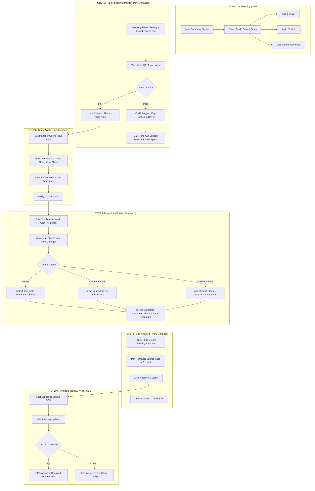
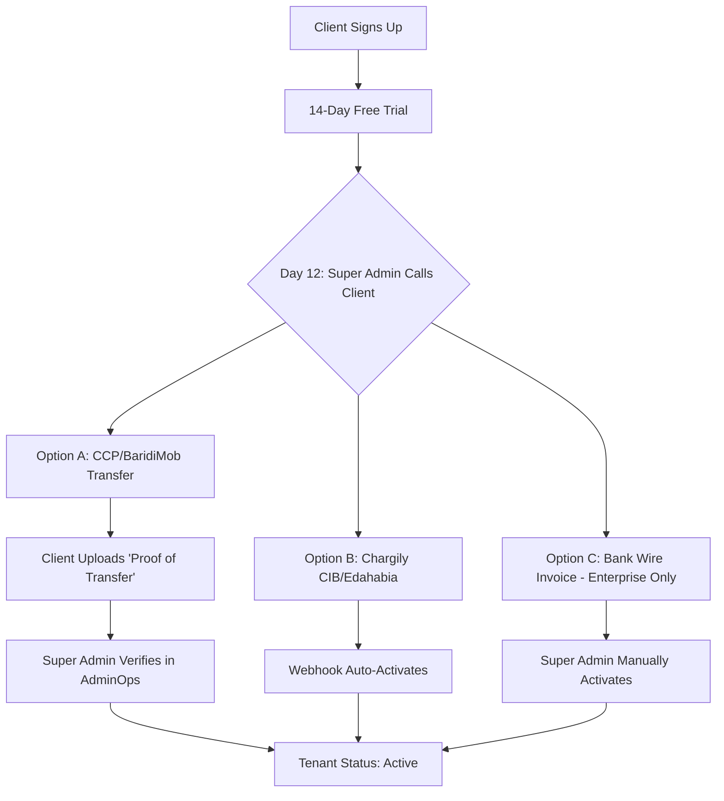

# FleetMan UX Architecture & Complete Process Analysis

> **Version:** 4.0 — Built exclusively from workspace source documents  
> **Sources:** `global_product_requirements.md`, `ux_workflow_logic.md`, `gsd_phase_roadmap.md`, `architecture_compliance.md`, `pricing_marketing_strategy.md`, `design_system_admin_panel_research.md`, `0000_fleetman_initial_schema.sql`  
> **Rule:** Nothing in this document is assumed. Every statement maps to a specific source file.

---

## 1. Platform Identity

FleetMan is a **maintenance-first, zero-hardware** B2B SaaS for Algerian SME fleets (10–50 vehicles). It is explicitly **not** a GPS tracking product.

- **Core Value:** Reduce Total Cost of Ownership (TCO) by digitizing the Issue → Work Order → Resolution → Cost loop.
- **Anti-GPS Positioning:** "A GPS tells you where your truck died. FleetMan tells you why it's going to die next week—and stops it from leaving the yard." *(Source: pricing_marketing_strategy.md)*
- **Zero Hardware:** No GPS trackers, no OBD dongles. The system runs entirely on phones, tablets, and browsers the company already owns.

---

## 2. The 7 Roles (Exact RBAC From Source)

Sourced from `global_product_requirements.md` Section 2 and `ux_workflow_logic.md`.

| # | Role | Platform | Description | Key Constraint |
|---|------|----------|-------------|----------------|
| 1 | **Super Admin** | Web (AdminOps `/admin`) | FleetMan internal staff only. Manages tenants, payments, impersonation. | Invisible to clients. Separate `/admin` route guarded by `is_super_admin` column. |
| 2 | **CEO / Owner** | Web | Financial KPIs: TCO, CPK, approval workflows, vendor spend, CSV export. | Only sees aggregated money data. Does not manage vehicles directly. |
| 3 | **Park Manager** | Web **&** Mobile | **THE CORE USER.** Dispatcher + coordinator. Manages vehicles, assigns drivers, triages issues into work orders, runs eDVIRs, logs gate time-in/time-out. | Performs eDVIR **by default** (not the driver). Forced to listen to voice notes before writing work orders. |
| 4 | **Field Officer / Mechanic** | Mobile | Receives work orders, logs parts used, uploads receipts, closes tickets with resolution photo + signature. | Laser-focused UI: only sees "My Assigned Work Orders." No graphs, no fleet lists. |
| 5 | **Driver** | Mobile | **OPTIONAL EXCEPTION.** Only gets app access if the Park Manager explicitly toggles "Enable Driver App Access" for that specific driver. | If toggled OFF: the driver is just a name on the calendar. Zero software interaction. |
| 6 | **Gatekeeper** | Tablet (Kiosk Mode) | Logs vehicle entry/exit at the yard gate. Checks for valid Ordre de Mission. Maintains digital Main Courante (logbook). | Togglable module. Only available on Pro/Enterprise tiers. |
| 7 | **One-Man Army** | Web & Mobile | Solo SME operator. Combines CEO + Park Manager + Mechanic roles into one account. | During onboarding, selecting this preset auto-assigns `roles: ['field_manager', 'office_manager', 'mechanic', 'ceo']`. UI dynamically renders all relevant blocks. |

---

## 3. The Complete Data Lifecycle (The "Happy Path")

This is the exact 6-step loop from `ux_workflow_logic.md` Section 3.1 and the "Logical Data Funnel Summary."

---

## 4. Vehicle Status States (Exact From Source)

From `ux_workflow_logic.md` Section 3, the system uses these strict states to calculate KPIs:

| Status | Meaning | Who Sets It |
|--------|---------|-------------|
| `AVAILABLE` | In yard, ready to deploy | System (after Work Order closed or vehicle returned) |
| `IN_MISSION` | On assigned trip, generating revenue | Park Manager (assigns driver + Ordre de Mission) |
| `ADMINISTRATIVE_IN_USE` | Out of park for non-mission tasks (washing, insurance photos, technical inspection) | Park Manager |
| `OUT_OF_SERVICE` | Legally or mechanically unable to drive | Park Manager (failed eDVIR or expired documents) |
| `IN_SHOP` | Currently being repaired | System (when work order status = IN_PROGRESS) |
| `NEEDS_ATTENTION` | Light damage, still drivable | Park Manager (flag from audit) |

> **Note:** The deployed database schema (`0000_fleetman_initial_schema.sql`) currently has a simpler enum: `AVAILABLE`, `IN_USE`, `MAINTENANCE`, `OUT_OF_SERVICE`. The full status set above will need a migration update.

---

## 5. The Driver Exception (Exact Rules)

From `global_product_requirements.md` Section 3.3 and `ux_workflow_logic.md` Section 2.

**Default behavior:** The Driver does NOT use the app. The Park Manager performs the eDVIR and handles all digital logging.

**The toggleable exception:**
1. The Park Manager goes to admin settings on the Web Portal.
2. Toggles **"Enable Driver App Access"** for a specific, trusted driver.
3. If toggled ON:
   - Driver logs in. Sees **only** the vehicle assigned to them via the calendar.
   - Driver clicks "Time Out" to start their mission.
   - App forces them to run the eDVIR checklist before departure.
   - Driver can scan Fuel Receipts to log their own fuel consumption.
   - **Top Tier (Premium) Feature:** Silent discrete geo-ping. When the driver presses "Submit Fuel Log", the app grabs a one-time GPS coordinate to prove they are physically at the gas station.
4. If toggled OFF (default):
   - The driver is just a text-name on the Office Manager's calendar.
   - Zero software interaction. Completely invisible to the software layer.

**Geofencing for eDVIR:** Documented as a **Phase 2 / Scale feature**, not MVP. For MVP, the eDVIR is location-agnostic. *(Source: ux_workflow_logic.md Section 1, paragraph 1)*

---

## 6. The Gatekeeper Kiosk Workflow (Togglable Module)

From `global_product_requirements.md` Section 3.2.

**Activation:** Dynamically locked/unlocked via the client's subscription tier. Only available on Pro/Enterprise.

**The Flow:**
1. Tablet mounted at gate, locked to Kiosk route (`/kiosk/gate`).
2. Vehicle approaches → Guard scans QR sticker or types first 3 digits of plate.
3. Two large buttons: **[ENTRÉE]** and **[SORTIE]**.
4. Guard taps [SORTIE] → System checks for a valid Ordre de Mission.
   - **Valid:** Screen flashes green. Timestamp logged.
   - **Invalid:** Screen flashes red. Exit blocked.
5. "Journal" tab → Digital Main Courante for non-fleet visitors or anomalies.

---

## 7. Park Manager Daily Workflow (Detailed)

From `ux_workflow_logic.md` Section 1 — this is the most important persona.

| Time | Action | UX Detail |
|------|--------|-----------|
| **Shift Start** | Morning Yard Reconciliation | Trucks move 24/7 but management doesn't. Manager uses Night Guard's paper logs to input "Time Out" for trucks that departed early and "Time In" for late arrivals. *(MVP: location-agnostic; Phase 2: secured by geofencing)* |
| **Mid-Morning** | Asset Auditing (Control Checks) | Walks yard. Scans QR code stuck to physically parked trucks. Independent damage check. |
| **Pre-Departure** | eDVIR (Pre-Trip Check) | Selects vehicle in app → Checklist: Tires, Lights, Mirrors, Fluids, Odometer → Submit Pass or Fail. **The Manager is the default eDVIR user, not the driver.** |
| **On Fail** | Issue Generation | Submitting a failed audit or hitting "Report Problem" instantly creates an Open Issue paired with photos and Voice Notes. |
| **Throughout Day** | Gate Logging (Time In/Out) | Manually clicks "Time Out" when vehicle leaves, "Time In" when it returns. |

**UX Constraints for this role:**
- **Camera-First:** The camera is the ultimate proof of driver negligence.
- **High Contrast + Thick Buttons:** Algerian sun glare + gloved hands = min 48x48dp touch targets.
- **Offline-First:** Audit saves locally if in dead zone. Auto-syncs when 4G returns.

---

## 8. Office Manager / Park Manager (Web Portal) Workflow

From `ux_workflow_logic.md` Section 4.

| Action | Detail |
|--------|--------|
| **Triaging Inbox** | Dashboard highlights "Action Needed." Sees issues with attached Voice Notes and photos. |
| **Formal Work Order Conversion** | **MANDATORY:** The platform forces the Manager to play the audio and write a formal, structured Work Order before assigning. This is an administrative translation layer between a stressed field reporter and the mechanic. |
| **PM Reminders** | Configurable Predictive Early Alerts: 7, 14, or 30 days in advance based on Median Daily Usage (Distance) or Strict Timelines (e.g., 6 months for insurance renewals). Auto-populates fleet calendar. |
| **Driver Assignment + Ordre de Mission** | Calendar UI → Drop driver onto "Available" vehicle → Status auto-changes to "Assigned - Ready for Departure" → System auto-generates Ordre de Mission PDF. |
| **Vehicle State Recap** | Per-vehicle dashboard via search: Current Status, Assigned Driver, CPK, uploaded compliance docs (Contrôle Technique, Autorisation de Circulation, Assurance). |
| **Vendor & Partner Scoring** | Manages notation database. Classes external mechanic shops, vendors, and drivers by Quality of Service and Pricing/Efficiency scores. |

**UX Feel:** Information-dense. Tables, filters, bulk actions. Needs to display 50 trucks at once. Calendar views for schedule visualization.

---

## 9. Mechanic Workflow (Detailed)

From `ux_workflow_logic.md` Section 3.

| Step | Action | UX Detail |
|------|--------|-----------|
| 1 | Notification | Push notification: "Work Order #145 Assigned: Fix cracked mirror on Truck 10452-116-16." |
| 2 | Diagnosis | Opens work order. Sees the exact photo the Park Manager took. |
| 3 | Parts Consumption | **Internal Warehouse:** Select from "Light Warehouse" stock. System tracks remaining quantity. **Approved Suppliers:** Select from list, Office Manager can call to verify. **Cash Purchase:** Snap photo of receipt → OCR or manual DZD amount entry. |
| 4 | Resolution | Tap "Job Complete" → Snap resolution photo → Sign with finger. |

**Key Note:** Because mechanics are frequently outsourced in Algeria, the Park Manager can use the "Mechanic View" to oversee and log outsourced work themselves. *(Source: ux_workflow_logic.md Section 3)*

---

## 10. CEO Workflow

From `ux_workflow_logic.md` Section 5.

| View | Purpose |
|------|---------|
| **Executive Snapshot** | TCO pie chart: Fuel % / Maintenance % / Depreciation %. |
| **CPK Ranking** | Ranked list of vehicles by Cost-Per-Kilometer. Flag outliers. |
| **Approval Queue** | Routine repairs: auto-approved if under client-configured threshold (e.g., < 20,000 DZD). High-cost repairs: CEO reviews photos + parts list → Approve or Reject. |
| **Vendor Spend** | Aggregated reporting on top/bottom performing vendors and drivers (annotated by Park Manager). |
| **CSV Export** | "Export to CSV" on all tables for own accounting tools. |

**UX Feel:** Visual storytelling. Red for overruns, green for savings. Big "Approve" buttons. Export everywhere.

---

## 11. One-Man Army (Solo Operator) Logic

From `ux_workflow_logic.md` Section 6 and `global_product_requirements.md` Section 2.

**Problem:** In many Algerian SMBs (5–15 trucks), one person handles everything.

**Solution:** During onboarding, the client selects the "One-Man Army" preset:
- Auto-assigns: `roles: ['field_manager', 'office_manager', 'mechanic', 'ceo']`
- **Mobile App:** UI renders QR Scanner + eDVIR (Field roles) **plus** Work Order completion forms (Mechanic role).
- **Web Portal:** UI renders Dispatch Calendar (Office role) **plus** Financial Approvals (CEO role).
- No separate logins. Role-conditional `if/then` rendering based on the `roles[]` array from the `profiles` table.

---

## 12. Onboarding & Smart Guide Flow

From `global_product_requirements.md` Section 4.2.

| Step | Screen | Purpose |
|------|--------|---------|
| 1 | Account Creation | Split-screen UI. Email, password, Company Name. Auto-provisions a `tenants` row in Supabase. |
| 2 | Context Gathering | Select fleet size → defines defaults and feature tier. |
| 3 | Smart Guide (Blocking) | Interactive tour that **strictly forces** the user to: (1) Add/Invite exactly one Driver, (2) Register exactly one Vehicle, (3) Log a starting odometer reading. **Users cannot freely use the software until this structured setup is complete.** |

---

## 13. Subscription & Payment UX

From `pricing_marketing_strategy.md` and `design_system_admin_panel_research.md` Part 3.

### Pricing Tiers (Per Active Vehicle, Billed Annually)

| Tier | Vehicles | Price | Modules |
|------|----------|-------|---------|
| **Starter** | < 10 | ~1,000 DZD/vehicle/month | Core Maintenance Loop, One-Man Army role, Basic eDVIR |
| **Pro** | 11–50 | ~1,500 DZD/vehicle/month | + Full RBAC, Geofencing (Phase 2), CSV Exports |
| **Enterprise** | 50+ | Custom | + Gatekeeper Kiosk, API Access, On-Premise option |

### Payment Flow (Algeria-Specific)

**Key Rules:**
- **No auto-billing at MVP.** Algerian B2B clients are not accustomed to automatic charges.
- **CCP/BaridiMob is king.** 90% of Algerians have CCP. Zero friction.
- **Chargily reserved for scale** (50+ clients, when manual verification becomes bottleneck).
- **19% TVA** applies. Invoices must include NIF, Article number, TVA separation, sequential numbering.

### Trial Expiry UX
- **Subscription expired** = Read-Only Mode. All existing data preserved. Cannot submit new eDVIRs or work orders.
- Super Admin sees trial countdown per tenant. Auto-flags at Day 12 for commercial follow-up.

---

## 14. AdminOps Panel (Super Admin Only)

From `design_system_admin_panel_research.md` Part 2.

**Architecture:** Same Next.js app, `/admin` route group, guarded by `is_super_admin` middleware check. Returns 403 if user lacks the flag.

| Feature | Description |
|---------|-------------|
| Tenant Dashboard | All companies: name, plan, status (pending/active/suspended/expired), signup date, vehicle count |
| Approval Gate | New signups land in "Pending." Super admin reviews → "Approve" → welcome email + account activation |
| Trial Monitor | Countdown per tenant. Auto-flags at Day 12 |
| Suspend / Deactivate | One-click suspend for non-payment. Blocks login, preserves data |
| Impersonation ("Login As") | See exactly what the client sees for debugging/support |
| Payment Log | Manual entry: date, amount DZD, method (CCP/Chargily/Virement), receipt reference |

---

## 15. Predictive Maintenance (PM) Alert Logic

From `ux_workflow_logic.md` Section 4 and `gsd_phase_roadmap.md` Phase 7.

**Two trigger modes (configurable per client):**
1. **Distance-Based:** System calculates Median Daily Usage from odometer entries. Alerts fire when the vehicle approaches a maintenance interval (e.g., oil change every 10,000 km).
2. **Time-Based:** Strict calendar deadlines (e.g., insurance renewal every 6 months, Contrôle Technique annually).

**Alert windows:** Configurable at 7, 14, or 30 days before the predicted event.

**UX:** Alerts auto-populate the Web Portal fleet calendar for the Park Manager. The CEO sees aggregated "Compliance Health" on their dashboard.

---

## 16. Offline-First Strategy

From `fleetman_project_context.md` Section 2 and `gsd_phase_roadmap.md` Phase 3.

**Context:** Algerian industrial yards often have zero 4G (steel-roofed hangars, remote locations).

**Technical approach:**
- Local storage: SQLite/Hive (not browser IndexedDB or Supabase-specific caching).
- Photo/voice note capture works fully offline.
- Status indicator shows pending sync count.
- Background auto-sync when connectivity returns.
- Offline queue service: `offline_sync_service.dart`.

**Who needs offline:** Park Manager (yard audits) and Mechanic (workshop may have poor signal). The Web Portal users (CEO, Office Manager) are assumed to have stable office internet.

---

## 17. Bilingual Architecture (AR-DZ / FR-DZ)

From `gsd_phase_roadmap.md` Localization section and `fleetman_project_context.md`.

| Aspect | Rule |
|--------|------|
| **Primary Language** | `fr_DZ` (Algerian French) — All formal UI labels, legal documents, business reports |
| **Secondary Language** | `ar_DZ` (Algerian Arabic / Darija) — Field worker interfaces (drivers, mechanics) |
| **Flutter** | `.arb` files: `app_fr_DZ.arb` (template) + `app_ar_DZ.arb`. Layouts use `EdgeInsetsDirectional` and `AlignmentDirectional` (never `left`/`right`) |
| **Next.js** | `next-intl` with `fr-DZ` and `ar-DZ` locale routing |
| **RTL** | Full RTL flip when Arabic is selected |
| **Currency** | `NumberFormat` with `fr_DZ` locale for DZD display |
| **Fonts** | Latin: Inter/Roboto. Arabic: Noto Sans Arabic |

---

## 18. Database Schema: Current State & Required Evolution

### 18.1 What Is Currently Deployed

From `0000_fleetman_initial_schema.sql` — live on Supabase project `mzuippdkhsqifxacssex`.

| Table | Key Columns | RLS |
|-------|-------------|-----|
| `tenants` | id, name, subscription_tier, created_at | Super admin sees all; users see own tenant |
| `profiles` | id (→ auth.users), tenant_id, full_name, phone, roles[], is_super_admin | Own profile always visible; tenant-scoped otherwise |
| `vehicles` | id, tenant_id, plate_number, make, model, current_odometer, status (enum: AVAILABLE/IN_USE/MAINTENANCE/OUT_OF_SERVICE), insurance_expiry, controle_technique_expiry | Tenant-isolated |
| `edvir_inspections` | id, tenant_id, vehicle_id, inspector_id, odometer, checklist (JSONB), is_pass, notes | Tenant-isolated |
| `issues` | id, tenant_id, vehicle_id, reporter_id, description, photo_url, voice_note_url, status (enum: OPEN/TRIAGED/RESOLVED) | Tenant-isolated |
| `vendors` | id, tenant_id, name, contact_number, address | Tenant-isolated |
| `inventory_parts` | id, tenant_id, name, part_number, stock_quantity, unit_cost_dzd | Tenant-isolated |
| `work_orders` | id, tenant_id, vehicle_id, issue_id, mechanic_id, status (enum: PENDING/IN_PROGRESS/COMPLETED), cash_cost_dzd, receipt_url | Tenant-isolated |

### 18.2 Schema Gaps (Required Migrations to Support Full UX)

The following are **missing tables and columns** identified by tracing every UX workflow in Sections 3–15 back to the database.

#### Missing Tables

| Table Needed | UX Workflow That Requires It | Key Columns |
|-------------|------------------------------|-------------|
| `gate_logs` | Gatekeeper Kiosk (Section 6), Park Manager time-in/time-out (Section 7) | id, tenant_id, vehicle_id, logged_by (→profiles), type (ENTRY/EXIT), odometer, ordre_de_mission_id, notes, created_at |
| `driver_assignments` | Calendar drag-drop (Section 8), Driver Exception (Section 5) | id, tenant_id, vehicle_id, driver_id (→profiles), assigned_by (→profiles), assignment_date, status (ASSIGNED/ACTIVE/COMPLETED) |
| `ordres_de_mission` | Automated PDF generation (Section 8), Gate check for valid mission (Section 6) | id, tenant_id, vehicle_id, driver_id, assignment_id, pdf_url, valid_from, valid_until, created_at |
| `work_order_parts` | Parts consumption tracking (Section 9) — junction table | id, work_order_id, inventory_part_id, vendor_id (nullable — for external purchases), quantity, unit_cost_dzd, source (WAREHOUSE/EXTERNAL/CASH) |
| `fuel_logs` | Fuel cost tracking (KPI 1, 2, 13), TCO accuracy | id, tenant_id, vehicle_id, logged_by (→profiles), odometer_at_fill, liters, cost_dzd, vendor_name, receipt_url, created_at |
| `maintenance_schedules` | PM Alert Logic (Section 15) | id, tenant_id, vehicle_id, maintenance_type, interval_km, interval_days, last_performed_at, last_performed_odometer, next_due_date, next_due_odometer |
| `leads` | Landing page "Request Demo" form (Phase 7) | id, company_name, contact_name, email, phone, fleet_size, message, created_at |
| `payments` | AdminOps Payment Log (Section 14) | id, tenant_id, amount_dzd, tva_amount_dzd, method (CCP/CHARGILY/VIREMENT), receipt_reference, verified_by (→profiles), invoice_number, created_at |
| `vendor_ratings` | Vendor & Partner Scoring (Section 8) | id, tenant_id, vendor_id, rated_by (→profiles), quality_score (1-5), pricing_score (1-5), notes, created_at |

#### Missing Columns on Existing Tables

| Table | Missing Column | UX Workflow |
|-------|---------------|-------------|
| `tenants` | `status` (pending/active/suspended/expired) | AdminOps approval gate (Section 14) |
| `tenants` | `trial_ends_at`, `activated_at`, `suspended_at` | Trial monitor countdown (Section 14) |
| `tenants` | `max_vehicles`, `max_users` | Subscription tier enforcement |
| `tenants` | `billing_email`, `company_nif` | Invoice generation with TVA (Section 13) |
| `tenants` | `auto_approve_threshold_dzd` | CEO approval workflow — auto-approve below threshold (Section 10) |
| `tenants` | `pm_alert_window_days` | PM alert configuration — 7/14/30 days (Section 15) |
| `profiles` | `is_driver_app_enabled` | Driver togglable exception (Section 5) |
| `profiles` | `avatar_url` | User identification across Web/Mobile |
| `vehicles` | `assigned_driver_id` | Current driver assignment quick-lookup |
| `vehicles` | `qr_code_data` | QR scanning workflow (Section 7) |
| `vehicles` | `autorisation_circulation_expiry` | Compliance document tracking (Section 8) |
| `work_orders` | `resolution_photo_url` | Mechanic "Job Complete" proof (Section 9) |
| `work_orders` | `signature_url` | Mechanic finger-signature on completion (Section 9) |
| `work_orders` | `description` | Formal Work Order text written by Park Manager (Section 8, mandatory conversion) |
| `work_orders` | `priority` (LOW/MEDIUM/HIGH/CRITICAL) | Triage prioritization (Section 8) |
| `work_orders` | `approved_by`, `approved_at` | CEO/Park Manager approval chain (Section 10) |
| `issues` | `priority` (LOW/MEDIUM/HIGH/CRITICAL) | Triage prioritization |
| `issues` | `work_order_id` | Track which work order was spawned from this issue (reverse FK) |

#### Enum Expansion Required

| Enum | Current Values | Required Values (from UX workflow) |
|------|---------------|-----------------------------------|
| `vehicle_status` | AVAILABLE, IN_USE, MAINTENANCE, OUT_OF_SERVICE | AVAILABLE, **IN_MISSION**, **ADMINISTRATIVE_IN_USE**, **IN_SHOP**, **NEEDS_ATTENTION**, OUT_OF_SERVICE |
| `issue_status` | OPEN, TRIAGED, RESOLVED | OPEN, TRIAGED, **CONVERTED_TO_WO**, RESOLVED |
| `work_order_status` | PENDING, IN_PROGRESS, COMPLETED | PENDING, **AWAITING_PARTS**, IN_PROGRESS, **AWAITING_APPROVAL**, COMPLETED, **REJECTED** |

---

## 19. Design System Summary

From `design_system_admin_panel_research.md` Part 1 (Fleetio-inspired).

| Token | Value |
|-------|-------|
| Primary/Brand | Emerald Green `#1B5E20` (deeper Fleetio green) |
| Accent/CTA | Green `#43A047` |
| Status: Active | Green dot `#4CAF50` |
| Status: Overdue | Red `#D32F2F` |
| Status: Due Soon | Orange `#F57F17` |
| Background | `#F5F7FA` |
| Cards | White + `1px #E0E0E0` border |
| Text Primary | `#212121` |
| Text Secondary | `#757575` |
| Font (Latin) | Inter |
| Font (Arabic) | Noto Sans Arabic |
| Touch Target | Min 48x48dp |

> **Note:** The `gsd_phase_roadmap.md` defines a different color set (Deep Blue `#1A3A5C` primary, Safety Orange `#F28C28` accent). The design_system research doc uses Fleetio-inspired greens. This conflict needs resolution before Phase 1 coding.

---

## 20. KPI Dashboard Logic & Data Requirements

The CEO Dashboard (Phase 6) and Park Manager Dashboard require precise, data-driven KPI cards. Each KPI below is mapped to an exact formula, its data source within the FleetMan schema, and any schema gaps that must be resolved before the KPI can be calculated.

### 20.1 KPI Cards: CEO Dashboard (Web)

These are the primary financial and operational KPIs visible to the CEO / Owner role.

#### KPI 1: Total Cost of Ownership (TCO) — Per Vehicle

| Attribute | Value |
|-----------|-------|
| **What it shows** | The total money spent on a specific vehicle since it was added to the fleet |
| **Formula** | `TCO = SUM(work_orders.cash_cost_dzd) + SUM(work_order_parts.unit_cost_dzd × quantity)` per vehicle_id |
| **Card Display** | Large number in DZD (e.g., "1,245,000 د.ج") with a sparkline trend chart (monthly) |
| **Data Source (Current Schema)** | `work_orders.cash_cost_dzd` WHERE `vehicle_id = X` |
| **Schema Gap** | `work_order_parts` table doesn't exist yet. Currently, `cash_cost_dzd` is a single integer on `work_orders` — it cannot separate labor vs. parts vs. external purchases. Need `work_order_parts` junction table (see Section 18.2). Also missing: fuel costs. Consider adding a `fuel_logs` table or a `cost_type` enum on work orders to distinguish maintenance vs. fuel vs. insurance. |
| **Who Sees It** | CEO, Park Manager (Web) |

#### KPI 2: Cost Per Kilometer (CPK) — Per Vehicle

| Attribute | Value |
|-----------|-------|
| **What it shows** | How much each kilometer costs to operate a vehicle. The #1 metric for identifying "money pit" trucks |
| **Formula** | `CPK = TCO / (current_odometer - starting_odometer)` |
| **Card Display** | Number in DZD/km (e.g., "23.5 د.ج/km"). Color-coded: Green if below fleet average, Red if 30%+ above average |
| **Data Source (Current Schema)** | `vehicles.current_odometer` for current reading. `work_orders.cash_cost_dzd` for costs. |
| **Schema Gap** | Missing `vehicles.starting_odometer` — the odometer reading when the vehicle was first added to FleetMan. Without this, the denominator is wrong. Also missing fuel cost data (see KPI 1). |
| **Who Sees It** | CEO (Web) — as a ranked table: worst CPK at top |

#### KPI 3: Fleet Availability Rate

| Attribute | Value |
|-----------|-------|
| **What it shows** | Percentage of the fleet that is ready to work right now |
| **Formula** | `Availability = (Vehicles WHERE status IN ('AVAILABLE', 'IN_MISSION') / Total Vehicles) × 100` |
| **Card Display** | Large percentage with a donut chart. Green ≥ 85%, Orange 70–84%, Red < 70% |
| **Data Source (Current Schema)** | `vehicles.status` enum — count by status per tenant |
| **Schema Gap** | Current enum has only 4 values. Needs expansion to 6 values (see Section 18.2, enum expansion). The `IN_MISSION` status specifically means "productively deployed." |
| **Industry Benchmark** | 95%+ is best-in-class. Below 80% signals systemic maintenance problems. |
| **Who Sees It** | CEO, Park Manager (Web) |

#### KPI 4: Maintenance Cost Breakdown (Pie Chart)

| Attribute | Value |
|-----------|-------|
| **What it shows** | Where the maintenance money is going: internal parts, external vendor purchases, cash/receipts |
| **Formula** | `SUM(work_order_parts.unit_cost_dzd × quantity) GROUP BY source` where source = WAREHOUSE / EXTERNAL / CASH |
| **Card Display** | Pie chart with 3 segments. Helps CEO identify if too much cash is leaving uncontrolled. |
| **Data Source (Current Schema)** | Not possible — `work_orders` only has `cash_cost_dzd` as a flat integer |
| **Schema Gap** | Requires `work_order_parts` table with `source` column (WAREHOUSE/EXTERNAL/CASH). This is the same table needed for KPI 1. |
| **Who Sees It** | CEO (Web) |

#### KPI 5: High-Cost Repair Approval Queue

| Attribute | Value |
|-----------|-------|
| **What it shows** | Number of work orders awaiting CEO financial approval (cost exceeded tenant threshold) |
| **Formula** | `COUNT(work_orders) WHERE status = 'AWAITING_APPROVAL' AND cash_cost_dzd > tenant.auto_approve_threshold_dzd` |
| **Card Display** | Badge count (e.g., "3 en attente"). Big "Approve" / "Reject" buttons per item. |
| **Data Source (Current Schema)** | `work_orders.status` and `work_orders.cash_cost_dzd` |
| **Schema Gap** | `work_order_status` enum needs `AWAITING_APPROVAL` value. `tenants` needs `auto_approve_threshold_dzd` column. `work_orders` needs `approved_by`, `approved_at` columns. |
| **Who Sees It** | CEO (Web) — actionable |

#### KPI 6: Vendor Spend Ranking

| Attribute | Value |
|-----------|-------|
| **What it shows** | Which external vendors/shops are getting the most money, and their quality ratings |
| **Formula** | `SUM(work_order_parts.unit_cost_dzd × quantity) GROUP BY vendor_id, ORDER BY total DESC` |
| **Card Display** | Ranked table: Vendor Name, Total Spend (DZD), Average Quality Score (★), Number of WOs |
| **Data Source (Current Schema)** | `vendors` table exists. Cost data needs `work_order_parts` with `vendor_id` FK. |
| **Schema Gap** | `work_order_parts` table (Section 18.2) and `vendor_ratings` table (Section 18.2). |
| **Who Sees It** | CEO, Park Manager (Web) |

---

### 20.2 KPI Cards: Park Manager Dashboard (Web & Mobile)

These are the operational KPIs visible to the Park Manager.

#### KPI 7: eDVIR Pass/Fail Rate

| Attribute | Value |
|-----------|-------|
| **What it shows** | What percentage of daily inspections are passing vs failing — measures fleet physical health |
| **Formula** | `Pass Rate = (COUNT(edvir_inspections WHERE is_pass = true) / COUNT(edvir_inspections)) × 100` — filterable by date range |
| **Card Display** | Percentage with trend line (last 30 days). Red if pass rate drops below 80%. |
| **Data Source (Current Schema)** | ✅ `edvir_inspections.is_pass` — **this data is fully available** |
| **Schema Gap** | None. This KPI works with the current schema. |
| **Industry Benchmark** | 95%+ pass rate is healthy. Below 80% = systemic fleet deterioration. |
| **Who Sees It** | Park Manager (Web + Mobile), CEO (Web) |

#### KPI 8: Open Issues Count (By Priority)

| Attribute | Value |
|-----------|-------|
| **What it shows** | How many unresolved field issues exist right now, segmented by severity |
| **Formula** | `COUNT(issues) WHERE status = 'OPEN' GROUP BY priority` |
| **Card Display** | 4 colored badges: Critical (red), High (orange), Medium (yellow), Low (gray). Each shows a count. |
| **Data Source (Current Schema)** | `issues.status` exists |
| **Schema Gap** | `issues.priority` column is missing (see Section 18.2). Without it, all issues appear equal and triage is impossible. |
| **Who Sees It** | Park Manager (Web + Mobile) |

#### KPI 9: Mean Time to Repair (MTTR)

| Attribute | Value |
|-----------|-------|
| **What it shows** | Average time from when a work order is created to when it is completed — measures workshop efficiency |
| **Formula** | `MTTR = AVG(work_orders.completed_at - work_orders.created_at) WHERE status = 'COMPLETED'` |
| **Card Display** | Hours or days (e.g., "18h avg"). Trend line (last 30 days). Green ≤ 24h, Red > 72h. |
| **Data Source (Current Schema)** | `work_orders.created_at` exists |
| **Schema Gap** | `work_orders.completed_at` column is missing. Currently there is no timestamp for when a work order was actually finished. Need to add `completed_at TIMESTAMPTZ`. |
| **Industry Benchmark** | Best-in-class: 2–4 hours. Industry average: 12–18 hours. |
| **Who Sees It** | Park Manager (Web), CEO (Web) |

#### KPI 10: Preventive vs. Corrective Maintenance Ratio

| Attribute | Value |
|-----------|-------|
| **What it shows** | Whether the fleet is being proactively maintained or reactively patched. The single best indicator of maintenance program maturity. |
| **Formula** | `PM Ratio = COUNT(work_orders WHERE type = 'PREVENTIVE') / COUNT(work_orders) × 100` |
| **Card Display** | Donut chart: Green segment (Preventive) vs Red segment (Corrective). Target: 80/20 split. |
| **Data Source (Current Schema)** | Not possible — `work_orders` has no way to distinguish preventive from corrective work |
| **Schema Gap** | Need `work_orders.type` column with enum: `PREVENTIVE` / `CORRECTIVE` / `EMERGENCY`. A PM work order is one triggered by `maintenance_schedules` (distance or time alert). A corrective one is triggered by an `issue`. |
| **Industry Benchmark** | 80% preventive / 20% corrective is the gold standard. |
| **Who Sees It** | Park Manager (Web), CEO (Web) |

#### KPI 11: Compliance Heatmap (Legal Document Expiry)

| Attribute | Value |
|-----------|-------|
| **What it shows** | Which vehicles have expiring or expired legal documents (Insurance, Contrôle Technique, Autorisation de Circulation) |
| **Formula** | For each vehicle: `days_remaining = expiry_date - CURRENT_DATE`. Color: Green (> 30 days), Orange (7–30 days), Red (< 7 days), Black (expired). |
| **Card Display** | Grid of vehicle plates, each colored by worst-expiring document. Click to expand details. |
| **Data Source (Current Schema)** | ✅ `vehicles.insurance_expiry` and `vehicles.controle_technique_expiry` exist |
| **Schema Gap** | `vehicles.autorisation_circulation_expiry` column is missing (see Section 18.2). This is a legally required document in Algeria. |
| **Who Sees It** | Park Manager (Web), CEO (Web — as aggregate "X vehicles non-compliant") |

#### KPI 12: Vehicle Utilization Rate

| Attribute | Value |
|-----------|-------|
| **What it shows** | How much of the fleet is productively deployed vs sitting idle in the yard |
| **Formula** | `Utilization = (Days vehicle spent in IN_MISSION status / Total calendar days) × 100` per vehicle |
| **Card Display** | Ranked table: vehicle plate, utilization %, last mission date. Flag vehicles below 50% as "underutilized — consider selling." |
| **Data Source (Current Schema)** | Requires historical vehicle status tracking |
| **Schema Gap** | The current `vehicles.status` is a single column — it stores the *current* state but not *history*. To calculate utilization, we need either: (A) a `vehicle_status_history` table logging every status change with timestamp, or (B) compute it from `gate_logs` (time-out to time-in = mission duration). Option B is simpler and aligns with the Park Manager's existing workflow. |
| **Who Sees It** | CEO (Web), Park Manager (Web) |

---

### 20.3 Industry-Verified KPIs (Second Pass — Added After Competitor Research)

The following 3 KPIs were identified in the second verification against Fleetio, SimplyFleet, and Whip Around. They are standard in maintenance-first fleet platforms and do NOT require GPS/telematics.

#### KPI 13: Fuel Efficiency (L/100km)

| Attribute | Value |
|-----------|-------|
| **What it shows** | How efficiently each vehicle consumes fuel. Detects mechanical problems (injector issues, tire pressure) and potential fuel theft. |
| **Formula** | `Fuel Efficiency = (Liters Filled × 100) / (Odometer at Fill - Previous Odometer at Fill)` — uses the industry-standard "fill-to-fill" method |
| **Card Display** | L/100km per vehicle with trend line. Green if at or below manufacturer baseline, Red if 20%+ above. Fleet-wide average shown as big number. |
| **Data Source (Current Schema)** | ❌ Not possible — no fuel tracking exists |
| **Schema Gap** | Requires `fuel_logs` table: id, tenant_id, vehicle_id, logged_by, odometer_at_fill, liters, cost_dzd, vendor_name, receipt_url, created_at (see Section 18.2). The Park Manager or Office Manager logs each fuel receipt. |
| **Who Sees It** | CEO (Web), Park Manager (Web) |
| **Realistic for MVP?** | ✅ Yes — only requires manual receipt entry. No hardware. Core to the Anti-GPS value prop: "We help you find fuel leaks without a GPS." |

#### KPI 14: First-Time Fix Rate

| Attribute | Value |
|-----------|-------|
| **What it shows** | What percentage of repairs are done right the first time — measures mechanic/vendor quality |
| **Formula** | `FTF Rate = COUNT(work_orders WHERE vehicle_id NOT IN (work_orders within 30 days for same vehicle)) / COUNT(work_orders) × 100` — a work order is a "repeat" if the same vehicle has another WO within 30 days |
| **Card Display** | Percentage. Green ≥ 85%, Red < 70%. Can be broken down per mechanic or per vendor. |
| **Data Source (Current Schema)** | `work_orders.vehicle_id` + `work_orders.created_at` — needs a self-join query on the same vehicle within 30 days |
| **Schema Gap** | ✅ Calculable with current schema columns — but needs `work_orders.completed_at` for accurate window calculation. No new table needed. |
| **Who Sees It** | CEO (Web), Park Manager (Web) |
| **Realistic for MVP?** | ✅ Yes — derived from existing work order data. No additional input required. |

#### KPI 15: PM Compliance Rate (On-Time PM Completion)

| Attribute | Value |
|-----------|-------|
| **What it shows** | Whether scheduled preventive maintenance is being completed on or before the due date. Different from KPI 10 (ratio) — this measures *timeliness* of the planned work. |
| **Formula** | `PM Compliance = COUNT(maintenance_schedules WHERE last_performed_at ≤ next_due_date) / COUNT(maintenance_schedules) × 100` |
| **Card Display** | Percentage gauge. Green ≥ 95%, Orange 80-94%, Red < 80%. |
| **Data Source (Current Schema)** | ❌ Not possible — `maintenance_schedules` table doesn't exist |
| **Schema Gap** | Requires `maintenance_schedules` table (see Section 18.2). This is a Phase 7 feature per roadmap but the table structure should be designed now. |
| **Who Sees It** | Park Manager (Web), CEO (Web — as aggregate "Fleet PM Health: X%") |
| **Industry Benchmark** | 95%+ is best-in-class. Below 80% = high risk of emergency breakdowns. |
| **Realistic for MVP?** | 🟡 Partial — requires maintenance schedule setup first. Phase 7 feature, but data model should be ready. |

#### KPI 16: Data Health Score / Driver Notation (The "Triangle of Truth")

| Attribute | Value |
|-----------|-------|
| **What it shows** | A reliability percentage tracking how much a specific vehicle (or driver) can be trusted. It detects cheating by triangulating data between the Gatekeeper, Driver, and Mechanic. |
| **Formula** | `Base 100% - penalty_deductions`. Penalties applied when: Gatekeeper odometer contradicts Driver fuel log receipt; Receipts are missing odometer readings. |
| **Card Display** | A large percentage widget (0-100%). Vehicles/Drivers with < 75% are flagged red indicating active cheating or extreme negligence. |
| **Data Source (Current Schema)** | Derived calculation comparing `gate_logs.odometer`, `work_orders` odometers, and `fuel_logs.odometer_at_fill`. |
| **Schema Gap** | Fully solvable via server-side business logic using the existing/planned base tables. To streamline, `fuel_logs` has a simple column: `is_missing_odometer` (Boolean). |
| **Who Sees It** | CEO, Park Manager (Web) |
| **Realistic for MVP?** | ✅ Yes. Core to the Anti-cheat value proposition. |

---

### 20.4 KPI Data Requirements Summary

| Data Need | Currently in Schema? | Required For | Migration Priority |
|-----------|---------------------|-------------|-------------------|
| `work_order_parts` table | ❌ No | KPI 1, 4, 6 | 🔴 Before Phase 4 |
| `fuel_logs` table | ❌ No | KPI 1 (TCO fuel component), KPI 2 (CPK accuracy), KPI 13 | 🔴 Before Phase 4 |
| `vehicles.starting_odometer` | ❌ No | KPI 2 (CPK) | 🟡 Before Phase 6 |
| `work_orders.completed_at` | ❌ No | KPI 9 (MTTR), KPI 14 (FTF accuracy) | 🔴 Before Phase 4 |
| `work_orders.type` (PREVENTIVE/CORRECTIVE/EMERGENCY) | ❌ No | KPI 10 | 🟡 Before Phase 6 |
| `issues.priority` | ❌ No | KPI 8 | 🟡 Before Phase 4 |
| `vehicles.autorisation_circulation_expiry` | ❌ No | KPI 11 | 🟡 Before Phase 2 |
| `gate_logs` table | ❌ No | KPI 12 (Utilization via mission time) | 🟡 Before Phase 6 |
| `maintenance_schedules` table | ❌ No | KPI 15 (PM Compliance) | 🟡 Before Phase 7 |
| `edvir_inspections.is_pass` | ✅ Yes | KPI 7 | — |
| `vehicles.insurance_expiry`, `controle_technique_expiry` | ✅ Yes | KPI 11 | — |
| `vehicles.status` | ✅ Yes (needs enum expansion) | KPI 3 | 🟡 Before Phase 2 |
| `work_orders.cash_cost_dzd` + `vehicle_id` + `created_at` | ✅ Yes | KPI 1 (partial), KPI 14 | — |

### 20.5 KPI Visibility Matrix (Role × KPI)

| KPI | CEO | Park Manager | Mechanic | Driver |
|-----|-----|-------------|----------|--------|
| 1. TCO per Vehicle | ✅ | ✅ (own fleet) | ❌ | ❌ |
| 2. Cost Per Kilometer | ✅ | ✅ | ❌ | ❌ |
| 3. Fleet Availability | ✅ | ✅ | ❌ | ❌ |
| 4. Maintenance Cost Breakdown | ✅ | ❌ | ❌ | ❌ |
| 5. Approval Queue | ✅ (actionable) | ✅ (view only) | ❌ | ❌ |
| 6. Vendor Spend Ranking | ✅ | ✅ | ❌ | ❌ |
| 7. eDVIR Pass/Fail Rate | ✅ | ✅ | ❌ | ❌ |
| 8. Open Issues Count | ✅ (aggregate) | ✅ (detail) | ❌ | ❌ |
| 9. Mean Time to Repair | ✅ | ✅ | ❌ | ❌ |
| 10. PM vs Corrective Ratio | ✅ | ✅ | ❌ | ❌ |
| 11. Compliance Heatmap | ✅ (aggregate) | ✅ (detail) | ❌ | ❌ |
| 12. Vehicle Utilization | ✅ | ✅ | ❌ | ❌ |
| 13. Fuel Efficiency (L/100km) | ✅ | ✅ | ❌ | ❌ |
| 14. First-Time Fix Rate | ✅ | ✅ | ❌ | ❌ |
| 15. PM Compliance Rate | ✅ (aggregate) | ✅ (detail) | ❌ | ❌ |
| 16. Data Health / Driver Score| ✅ | ✅ | ❌ | ❌ |

---

## 21. Gaps & Open Questions Identified

| # | Gap | Source of Conflict | Severity |
|---|-----|--------------------|----------|
| 1 | **Color System Conflict:** ~~Roadmap says Deep Blue...~~ **RESOLVED:** Deep Blue (#1A3A5C) is now the formalized primary color across all docs. `design_system_admin_panel_research.md` was updated. | `ux_architecture_analysis.md` | 🟢 Resolved |
| 2 | **Vehicle Status Enum:** Deployed DB has 4 states. UX workflow defines 6 states. See Section 18.2 for required migration. | `0000_fleetman_initial_schema.sql` vs `ux_workflow_logic.md` | 🟡 Migration needed before Phase 2 |
| 3 | **9 Missing Tables:** gate_logs, driver_assignments, ordres_de_mission, work_order_parts, **fuel_logs**, maintenance_schedules, leads, payments, vendor_ratings. See Section 18.2. | UX workflows + KPI analysis vs deployed schema | 🟡 Migrations needed incrementally per phase |
| 4 | **17+ Missing Columns:** tenants needs 7, profiles needs 2, vehicles needs 4 (incl. starting_odometer), work_orders needs 7 (incl. completed_at, type), issues needs 2. See Sections 18.2 and 20.4. | UX workflows + KPI requirements vs deployed schema | 🟡 Migrations needed incrementally per phase |
| 5 | **Geofencing Timeline:** PRD says "Phase 2 Scale feature." Roadmap Phase 5 implies it's in MVP1. README mentions it. Clarify scope. | Multiple docs | 🟡 Needs decision |
| 6 | **OCR Provider:** Multiple docs reference receipt OCR but no specific provider or API is selected. | `ux_workflow_logic.md` | 🟢 Can defer — manual fallback exists |
| 7 | **Push Notifications:** Mentioned for Mechanic workflow but FCM/APNs setup is Phase 11, not MVP1. | `ux_workflow_logic.md` vs `gsd_phase_roadmap.md` | 🟢 Can use in-app polling for MVP1 |
| 8 | **Work Order lacks description column:** The mandatory "formal write-up" by Park Manager (Section 8) has no column to store it. | `ux_workflow_logic.md` vs schema | 🔴 Blocks Phase 4 |
| 9 | **No parts tracking on work orders:** Mechanic logs parts used (Section 9) but there's no `work_order_parts` junction table. Cost tracking is limited to a single `cash_cost_dzd` integer. Blocks KPIs 1, 4, 6. | `ux_workflow_logic.md` + KPI Section 20 vs schema | 🔴 Blocks Phase 4 |
| 10 | **Tenant has no status column:** AdminOps approval flow (Section 14) requires pending/active/suspended/expired but the deployed `tenants` table only has `subscription_tier`. | `design_system_admin_panel_research.md` vs schema | 🔴 Blocks Phase 6.5 |
| 11 | **No fuel cost tracking:** `fuel_logs` table now defined in Section 18.2. Required for TCO, CPK, and Fuel Efficiency KPIs (1, 2, 13). | KPI requirements vs schema | 🔴 Before Phase 4 |
| 12 | **No vehicle status history:** Vehicle Utilization (KPI 12) requires historical status changes. Current schema only stores the current status. | KPI requirements vs schema | 🟡 Can approximate from `gate_logs` |
